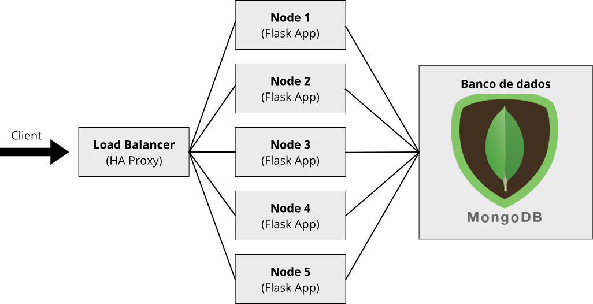

# R2: Reserve a Room - Image

Este é o projeto final da disciplina Computação em Nuvem (2018.2) do curso de Engenharia da Computação do Insper, que consiste em uma imagem Docker que cria conteiners para [aplicação Reserve Room](https://github.com/martimfj/R2App), implementando ainda o HAProxy como load balancer. Essa imagem cria um conteiner para o bando de dados (MongoDB), um conteiner para o Load Balancer (HAProxy) e cinco conteiners para a aplicação feita em Flask.



## Instalação
Para instalar as dependências do Docker CE e Docker Compose, rode o script `install`;

```$ ./install```

## Utilização
Após instalar as dependências, é possível criar os conteiners automaticamente via o script `start`, escalando 5 conteiners para a aplicação. Ou manualmente (permitindo customizar) seguindo os passos abaixo:

### Para instalar a imagem:
```$ docker-compose build```

### Para iniciar os conteiners:
```$ docker-compose -d up --scale reserveroom=5```
* **obs1:** Utilize a flag -d para executar em segundo plano.
* **obs2:** Utilize a flag --scale reserveroom=5 para escalar 5 conteiners com a aplicação. 

### Para escalar mais conteiners de aplicação:
```$ ./scale <10>``` 
* **obs:** O argumento que o script recebe é o número de conteiners que você quer que tenha. Por exemplo, se já houver 5 conteiners e o objetivo é adicionar mais 5, o argumento deve ser 10.

### Para desligar os conteiners:
```$ ./stop``` 

ou

``` docker-compose down ```

## Comandos úteis
### Verificar as imagens presentes no sistema:
```$ docker images```
```
REPOSITORY            TAG                 IMAGE ID            CREATED             SIZE
r2image_reserveroom   latest              f6f9cd706c52        29 minutes ago      499MB
mongo                 latest              525bd2016729        8 days ago          383MB
ubuntu                18.04               93fd78260bd1        9 days ago          86.2MB
dockercloud/haproxy   latest              4d6ae6c16c4d        11 months ago       42.6MB
```

### Verificar se há algum conteiner em execução:
```$ docker-compose ps```
```
           Name                       Command             State             Ports           
--------------------------------------------------------------------------------------------
r2image_loadbalancer_1_20b   /sbin/tini -- dockercloud-   Up      1936/tcp, 443/tcp,        
50230cec9                    ...                                  0.0.0.0:80->80/tcp        
r2image_mongo_1_b0c362e6bb   docker-entrypoint.sh         Up      0.0.0.0:27017->27017/tcp  
14                           mongod                                                         
r2image_reserveroom_1_caf5   /bin/sh -c python applicat   Up      5000/tcp                  
0184ff83                     ...                                                            
r2image_reserveroom_2_c228   /bin/sh -c python applicat   Up      5000/tcp                  
002c2842                     ...                                                            
r2image_reserveroom_3_7948   /bin/sh -c python applicat   Up      5000/tcp                  
d058cc87                     ...                                                            
r2image_reserveroom_4_c721   /bin/sh -c python applicat   Up      5000/tcp                  
ccd300fa                     ...                                                            
r2image_reserveroom_5_4da2   /bin/sh -c python applicat   Up      5000/tcp                  
7351b66c                     ...                                        
```

### Para excluir as imagens criadas e desinstalar as dependências instaladas:
```$ ./clean```